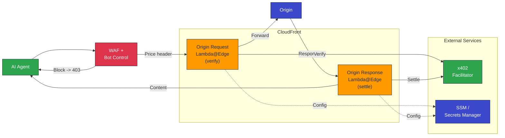
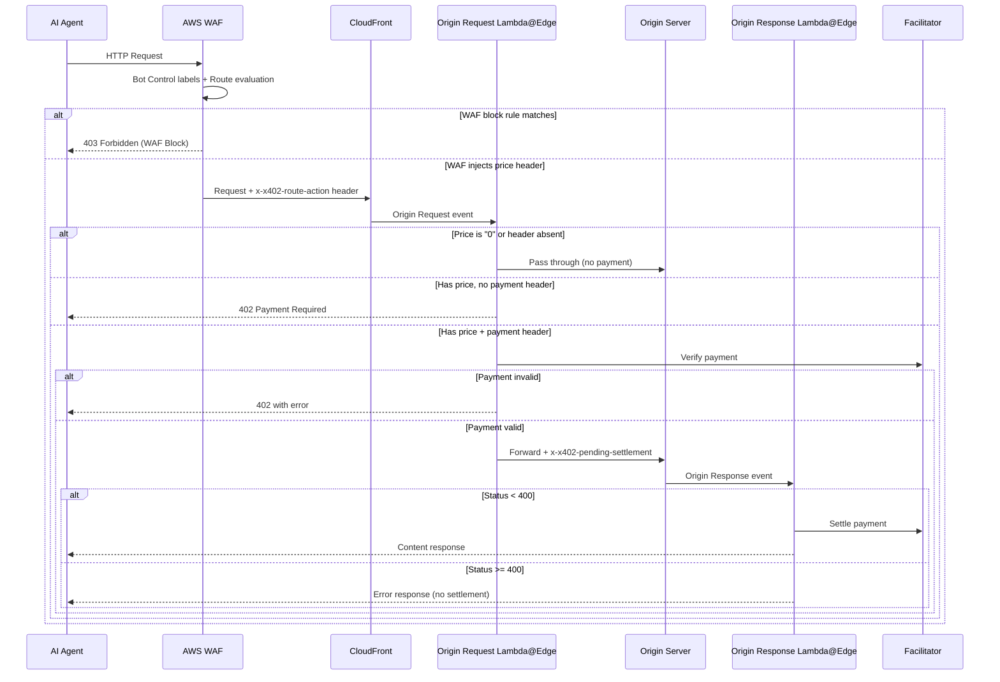

# sample-x402-content-monetization-with-cloudfront-and-waf

Monetize your content with one-click deployment. This solution uses the [x402 payment protocol](https://x402.org) to charge AI agents and bots for accessing your content — payments in USDC stablecoins on the Base blockchain, enforced at the AWS edge.

Deploy a single SAM stack and get: Amazon CloudFront distribution with sample content, AWS WAF with Bot Control v5 (650+ bots), AWS Lambda@Edge payment verification and settlement, a visual route config editor, and a revenue dashboard. Configuration lives in AWS Systems Manager (SSM) Parameter Store, credentials in AWS Secrets Manager, logs in Amazon CloudWatch, and content in Amazon S3. No servers to manage, no code to write.


## How It Works

Publishers configure pricing per URL path with condition-based access policies. Verified bots, unverified bots, and humans can each have different prices — or be blocked entirely. Configuration lives in SSM Parameter Store and can be updated without redeployment.

## Architecture



### Request Sequence



## Route Configuration

Routes use glob patterns and condition-based access policies. The config is stored in SSM Parameter Store and can be updated without redeployment — use the visual editor or the CLI.


The default deployment includes sample content with per-route pricing:

| Route | Verified Bots | Unverified Bots | Humans |
|---|---|---|---|
| `/api/sports.json` | $0.003/req | $0.03/req | Blocked |
| `/api/politics.json` | $0.005/req | $0.05/req | Blocked |
| `/articles/politics.html` | $0.002/req | $0.02/req | Free |
| `/api/**` (catch-all) | $0.003/req | $0.03/req | Blocked |
| `/articles/**` (catch-all) | $0.001/req | $0.01/req | Free |
| `/**` (catch-all) | Free | $0.001/req | Free |

Routes are evaluated top to bottom — the first matching pattern wins. Within a route, policies are evaluated top to bottom — the first matching condition determines the action. Conditions match against [AWS WAF Bot Control labels](https://docs.aws.amazon.com/waf/latest/developerguide/aws-managed-rule-groups-bot.html).

### Config Format

- **`pattern`** — URL path glob: `*` matches a single segment, `**` matches multiple segments, exact paths match literally
- **`condition`** — WAF label string, `"default"` (fallback), or boolean expressions (`and`, `or`, `not`) for combining conditions
- **`action`** — price in USD (e.g. `"0.001"`), `"0"` for free, or `"block"` to deny access

### Update Pricing (No Redeployment)

```bash
aws ssm put-parameter \
  --name "/x402-edge/<stack-name>/config/routes" \
  --value '<paste JSON here>' \
  --type String \
  --overwrite
```

Changes propagate to WAF within seconds via EventBridge. A scheduled sync runs every 5 minutes as a catch-up mechanism. You can also use the visual editor at `/editor/index.html`.

## AI Activity Dashboard

AWS WAF includes the [AI Activity Dashboard](https://aws.amazon.com/about-aws/whats-new/2026/02/aws-waf-ai-activity-dashboard/). It provides visibility into AI bot traffic trends, showing which AI bots are accessing your content, request volumes over time, and category breakdowns — helping you make informed pricing decisions.

## Facilitator Selection

| FacilitatorType | Service | Auth Required | Networks |
|---|---|---|---|
| `x402.org` | `https://x402.org/facilitator` | No | Testnet only (Base Sepolia, Solana Devnet) |
| `cdp` | CDP Facilitator | Yes (CDP API key) | Testnet + Mainnet (Base, Base Sepolia, Solana, Solana Devnet) |

The facilitator handles payment verification and on-chain settlement. The `x402.org` facilitator is testnet-only — use `cdp` for mainnet deployments. See the [x402 network support](https://www.x402.org/) docs for details.

> **Third-party facilitators:** The x402 ecosystem includes additional facilitators beyond the two built-in options. Browse the full list at [x402.org/ecosystem](https://www.x402.org/ecosystem?filter=facilitators). Third-party facilitators may require additional changes (e.g., authentication) that are not yet supported — contributions are welcome!

## Getting Started

### Prerequisites

- AWS account with permissions to create CloudFront, WAF, Lambda, SSM, Secrets Manager, and S3 resources
- [AWS SAM CLI](https://docs.aws.amazon.com/serverless-application-model/latest/developerguide/install-sam-cli.html)
- Node.js 24+
- An Ethereum wallet address (for receiving USDC payments)

### Deploy

```bash
sam build
sam deploy --guided --region us-east-1 --capabilities CAPABILITY_NAMED_IAM
```

SAM will prompt for these parameters:

| Parameter | Description | Default |
|---|---|---|
| `PayToAddress` | Your Ethereum wallet address (receives USDC) | (required) |
| `Network` | `eip155:84532` (Base Sepolia testnet) or `eip155:8453` (Base mainnet) | `eip155:84532` |
| `FacilitatorType` | `x402.org` (free, no auth, testnet only) or `cdp` (requires CDP API key, testnet + mainnet) | `x402.org` |
| `RouteConfigJson` | Pricing configuration JSON (see above) | Default config |
| `OriginDomainName` | Custom origin domain (empty = sample S3 origin) | `""` |
| `CdpApiKeyName` | CDP API key name (only when FacilitatorType is `cdp`) | `""` |
| `CdpApiKeyPrivateKey` | CDP API key private key (only when FacilitatorType is `cdp`) | `""` |

Stack outputs include:
- **CloudFront URL** — your payment-gated content
- **Editor URL** — visual route config editor at `/editor/index.html`
- **Dashboard URL** — CloudWatch revenue dashboard

### Traffic Generator

A traffic generator is included for testing and demos. It sends real HTTP traffic with actual on-chain x402 payments. See [`scripts/README.md`](scripts/README.md) for setup and usage.

```bash
npx tsx scripts/traffic-gen.ts                # one-shot playlist (18 requests)
npx tsx scripts/traffic-gen.ts --duration 15  # continuous mode (15 min, sinusoidal trends)
```


### Development

```bash
npm install
npm test                    # all tests
npm run test:unit           # unit tests
npm run test:property       # property-based tests (fast-check)
npm run test:integration    # integration tests with mocked AWS SDK
```

## Security

See [CONTRIBUTING](CONTRIBUTING.md#security-issue-notifications) for more information.

## License

This library is licensed under the MIT-0 License. See the LICENSE file.
