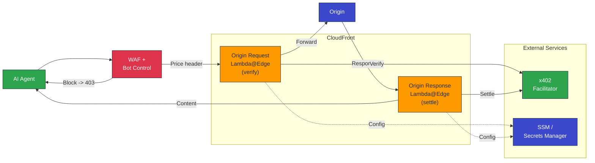
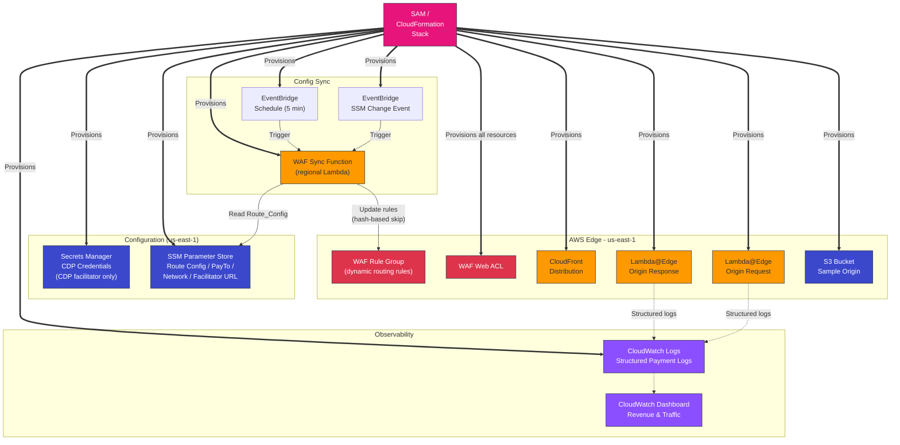
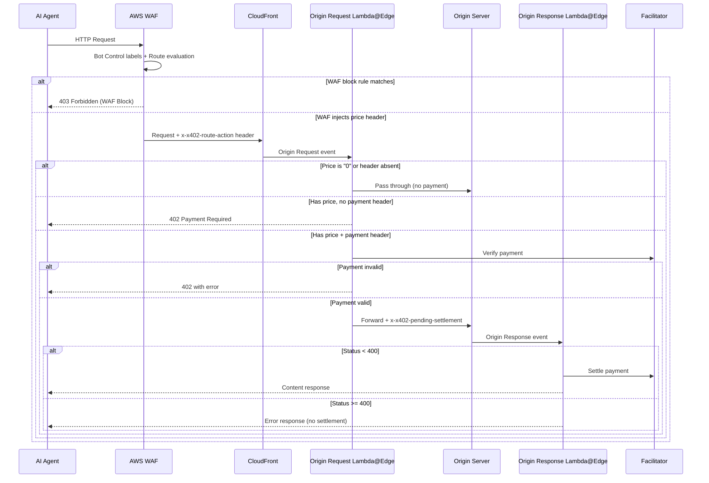
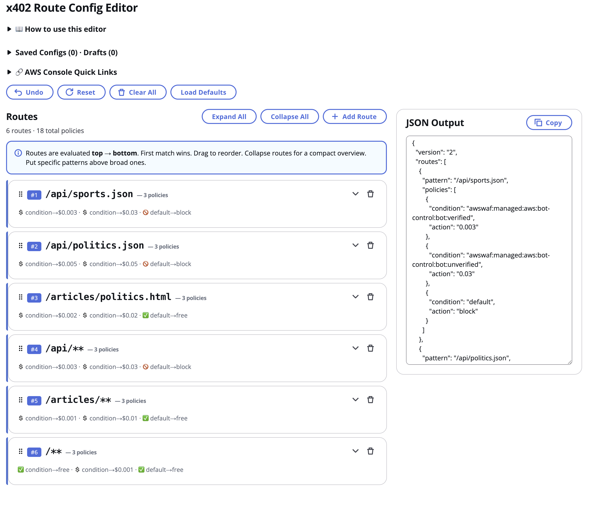
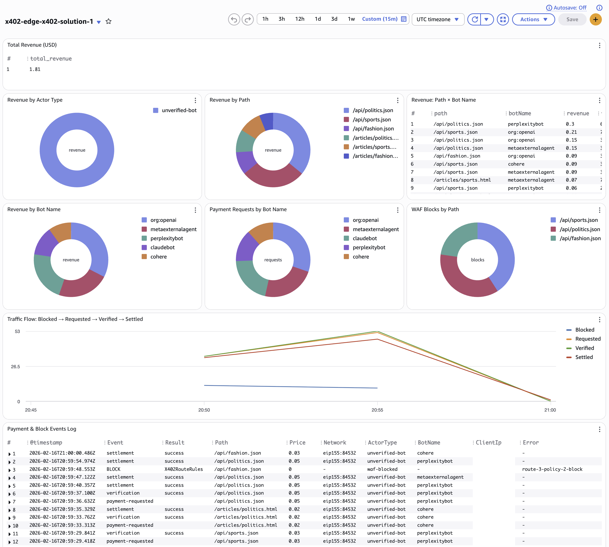
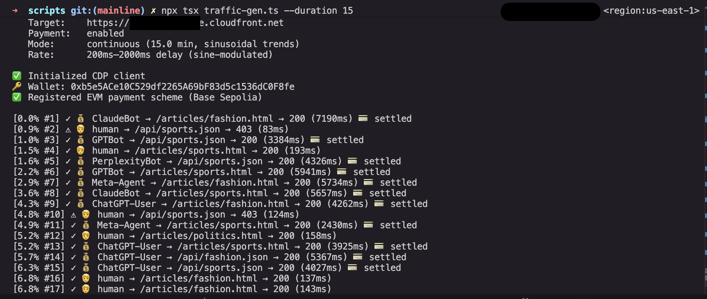

# sample-x402-content-monetization-with-cloudfront-and-waf

Monetize your content with one-click deployment. This solution uses the [x402 payment protocol](https://x402.org) to charge AI agents and bots for accessing your content — payments in USDC stablecoins on the Base blockchain, enforced at the AWS edge.

Deploy a single SAM stack and get: Amazon CloudFront distribution with sample content, AWS WAF with Bot Control, AWS Lambda@Edge payment verification and settlement, a visual route config editor, and a revenue dashboard. Configuration lives in AWS Systems Manager (SSM) Parameter Store, credentials in AWS Secrets Manager, logs in Amazon CloudWatch, and content in Amazon S3. No servers to manage, no code to write.

## How It Works

```
AI Agent → WAF (classify + price) → Lambda@Edge (verify payment) → Origin → Lambda@Edge (settle on-chain) → Response
```

Publishers configure pricing per URL path with condition-based access policies. Verified bots, unverified bots, and humans can each have different prices — or be blocked entirely. Configuration lives in SSM Parameter Store and can be updated without redeployment.

## Architecture

### Runtime — Request Flow



### Backoffice — Config Sync, Observability & Provisioning



### Request Sequence



## Quick Start

### Prerequisites

- AWS account with permissions to create CloudFront, WAF, Lambda, SSM, Secrets Manager, and S3 resources
- [AWS SAM CLI](https://docs.aws.amazon.com/serverless-application-model/latest/developerguide/install-sam-cli.html)
- Node.js 24+
- An Ethereum wallet address (for receiving USDC payments)

### Deploy

```bash
sam build
sam deploy --guided --region us-east-1 --capabilities CAPABILITY_NAMED_IAM
```

SAM will prompt for these parameters:

| Parameter | Description | Default |
|---|---|---|
| `PayToAddress` | Your Ethereum wallet address (receives USDC) | (required) |
| `Network` | `eip155:84532` (Base Sepolia testnet) or `eip155:8453` (Base mainnet) | `eip155:84532` |
| `FacilitatorType` | `x402.org` (free, no auth) or `cdp` (requires CDP API key) | `x402.org` |
| `RouteConfigJson` | Pricing configuration JSON (see below) | Default config |
| `OriginDomainName` | Custom origin domain (empty = sample S3 origin) | `""` |
| `CdpApiKeyName` | CDP API key name (only when FacilitatorType is `cdp`) | `""` |
| `CdpApiKeyPrivateKey` | CDP API key private key (only when FacilitatorType is `cdp`) | `""` |

The stack provisions everything: CloudFront distribution, WAF with Bot Control, Lambda@Edge functions, SSM parameters, sample S3 origin with content, a visual route config editor, and a CloudWatch revenue dashboard.

Stack outputs include:
- **CloudFront URL** — your payment-gated content
- **Editor URL** — visual route config editor at `/editor/index.html`
- **Dashboard URL** — CloudWatch revenue dashboard

### Route Config Editor

Configure pricing visually — drag to reorder routes and policies, set prices per actor type, deploy with one click.



### Sample Content

The default deployment includes sample content across three categories:

| HTML Articles | JSON API Endpoints |
|---|---|
| `/articles/sports.html` | `/api/sports.json` |
| `/articles/fashion.html` | `/api/fashion.json` |
| `/articles/politics.html` | `/api/politics.json` |

Humans browse articles for free. Bots pay per request. API endpoints block non-bot traffic.

## Route Configuration

Routes use glob patterns and condition-based access policies. The config is stored in SSM Parameter Store and can be updated without redeployment.

### Default Config

The default config prices specific routes individually, with wildcard catch-alls for any additional paths:

```json
{
  "version": "2",
  "routes": [
    { "pattern": "/api/sports.json",        "policies": [/*...*/] },
    { "pattern": "/api/politics.json",      "policies": [/*...*/] },
    { "pattern": "/articles/politics.html", "policies": [/*...*/] },
    { "pattern": "/api/**",                 "policies": [/*...*/] },
    { "pattern": "/articles/**",            "policies": [/*...*/] },
    { "pattern": "/**",                     "policies": [/*...*/] }
  ]
}
```

Each route has three policies — one per actor type:

| Route | Verified Bots | Unverified Bots | Humans |
|---|---|---|---|
| `/api/sports.json` | $0.003/req | $0.03/req | Blocked |
| `/api/politics.json` | $0.005/req | $0.05/req | Blocked |
| `/articles/politics.html` | $0.002/req | $0.02/req | Free |
| `/api/**` (catch-all) | $0.003/req | $0.03/req | Blocked |
| `/articles/**` (catch-all) | $0.001/req | $0.01/req | Free |
| `/**` (catch-all) | Free | $0.001/req | Free |

Routes are evaluated top to bottom — specific paths match before wildcards.

### Config Format

- **`pattern`** — URL path glob: `*` matches a single segment, `**` matches multiple segments, exact paths match literally
- **`condition`** — WAF label string, `"default"` (fallback), or boolean expressions (`and`, `or`, `not`) for combining conditions
- **`action`** — price in USD (e.g. `"0.001"`), `"0"` for free, or `"block"` to deny access

Routes are evaluated top to bottom — the first matching pattern wins. Within a route, policies are evaluated top to bottom — the first matching condition determines the action.

Conditions match against [AWS WAF Bot Control labels](https://docs.aws.amazon.com/waf/latest/developerguide/aws-managed-rule-groups-bot.html). Version 2 supports boolean expressions:

```json
{
  "condition": { "and": [
    "awswaf:managed:aws:bot-control:bot:verified",
    { "namespace": "awswaf:managed:aws:bot-control:bot-category" }
  ]},
  "action": "0.01"
}
```

### Update Pricing (No Redeployment)

```bash
aws ssm put-parameter \
  --name "/x402-edge/<stack-name>/config/routes" \
  --value '<paste JSON here>' \
  --type String \
  --overwrite
```

Changes propagate to WAF within seconds via EventBridge. A scheduled sync runs every 5 minutes as a catch-up mechanism. You can also use the visual editor at `/editor/index.html`.

## Key Components

| Component | Purpose |
|---|---|
| **CloudFront Distribution** | CDN and edge compute host |
| **WAF Web ACL + Bot Control** | Traffic classification, bot verification, route-level blocking |
| **WAF Rule Group** (dynamic) | Translates route config into WAF rules — single source of truth for routing |
| **Lambda@Edge Origin Request** | x402 payment verification, 402 response generation |
| **Lambda@Edge Origin Response** | Payment settlement on successful origin response |
| **WAF Sync Function** | Keeps WAF rules in sync with SSM route config (event-driven via EventBridge + 5-minute scheduled catch-up) |
| **SSM Parameter Store** | Publisher config: routes, wallet address, network, facilitator URL |
| **Secrets Manager** | CDP API credentials (when using CDP facilitator) |
| **Route Config Editor** | Visual editor for route configuration, served at `/editor/index.html` |
| **CloudWatch Dashboard** | Revenue dashboard: total revenue, top agents, top paths, traffic flow, failed payments |

### CloudWatch Revenue Dashboard



## Facilitator Selection

| FacilitatorType | Service | Auth Required |
|---|---|---|
| `x402.org` | `https://x402.org/facilitator` | No |
| `cdp` | CDP Facilitator | Yes (CDP API key) |

The facilitator handles payment verification and on-chain settlement. The choice is independent of the network — you can use either facilitator on testnet or mainnet.

## Traffic Generator

A traffic generator is included for testing and demos. It sends real HTTP traffic with actual on-chain x402 payments. See [`scripts/README.md`](scripts/README.md) for setup and usage.

```bash
npx tsx scripts/traffic-gen.ts                # one-shot playlist (18 requests)
npx tsx scripts/traffic-gen.ts --duration 15  # continuous mode (15 min, sinusoidal trends)
```



## Development

```bash
npm install
npm test                    # all tests
npm run test:unit           # unit tests
npm run test:property       # property-based tests (fast-check)
npm run test:integration    # integration tests with mocked AWS SDK

sam build                   # build with SAM (esbuild, @aws-sdk/* external)
sam deploy --guided --region us-east-1 --capabilities CAPABILITY_NAMED_IAM
```

### Project Structure

```
src/
  runtime/
    origin-request/     # Lambda@Edge origin-request handler (verify payment)
    origin-response/    # Lambda@Edge origin-response handler (settle payment)
    shared/             # Types, config loader, CloudFront adapter, logger, x402 middleware
  backoffice/
    waf-sync/           # WAF sync function, rule translator, pattern matcher
    content-deploy/     # Sample content deployment (custom resource)
    editor-deploy/      # Route editor deployment (custom resource)
editor/                 # Visual route config editor (React + Cloudscape)
sample-content/         # Static HTML articles + JSON API responses
scripts/                # Traffic generator
tests/
  unit/                 # Unit tests
  property/             # Property-based tests (fast-check)
  integration/          # Integration tests with mocked AWS SDK
template.yaml           # SAM template
```

## Security

See [CONTRIBUTING](CONTRIBUTING.md#security-issue-notifications) for more information.

## License

This library is licensed under the MIT-0 License. See the LICENSE file.

