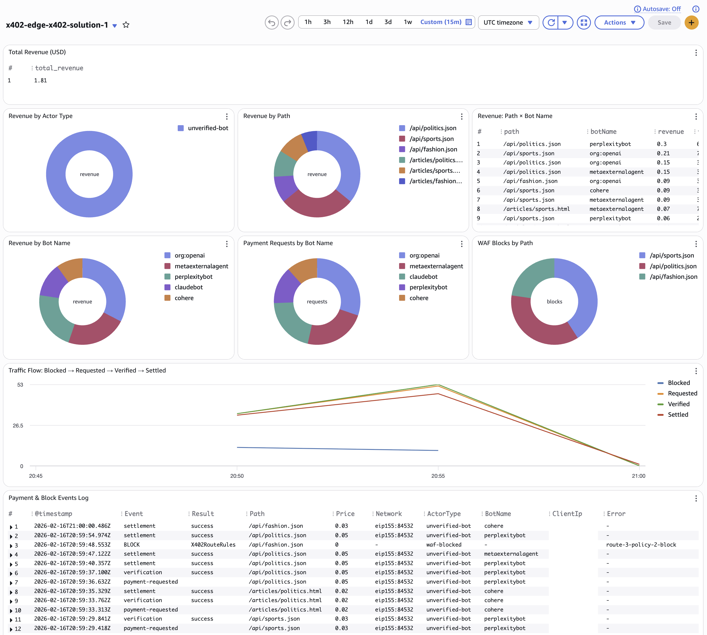
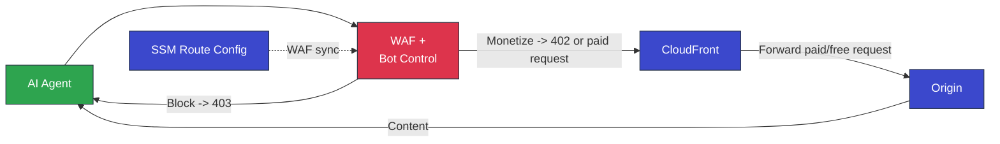
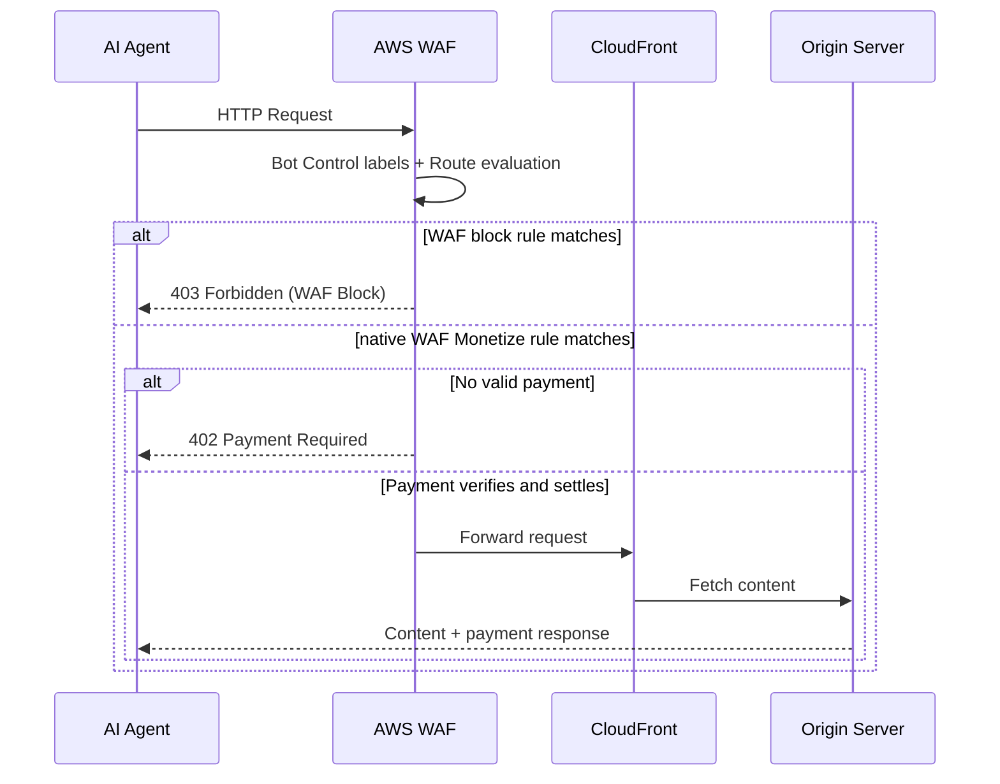
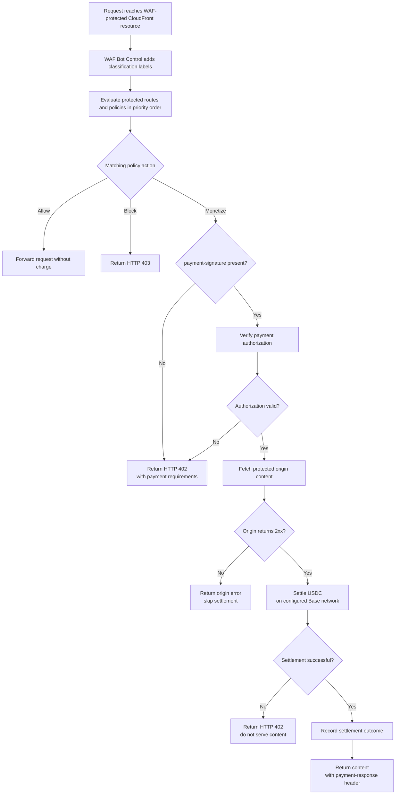
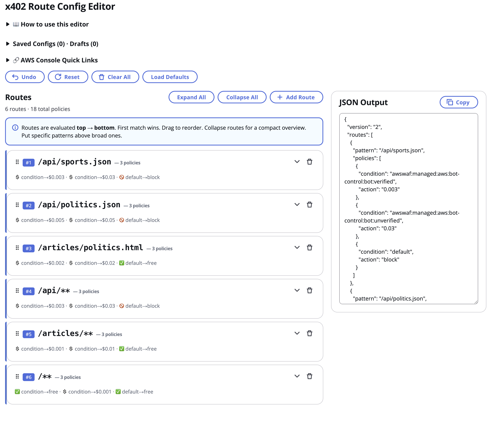
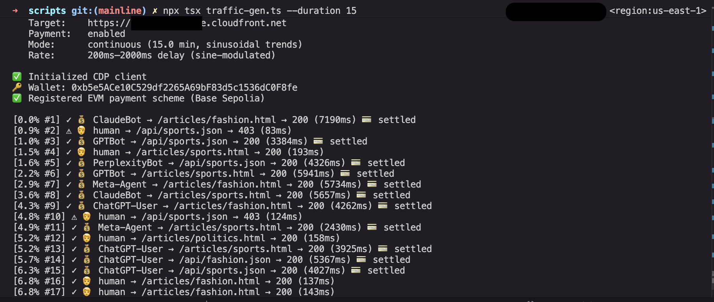

# sample-x402-content-monetization-with-cloudfront-and-waf

## About this fork

This repository is a fork of the AWS-owned sample
[`aws-samples/sample-x402-content-monetization-with-cloudfront-and-waf`](https://github.com/aws-samples/sample-x402-content-monetization-with-cloudfront-and-waf).
AWS retains ownership, original authorship, copyright, licensing, and attribution for the upstream sample. The fork maintainer does not claim authorship of the original AWS work.

This fork contains experimental modifications that migrate route enforcement to the native AWS WAF `MONETIZE` action. It is configured by default for Base Sepolia testnet and test USDC. Traffic-generation scripts simulate AI bot `User-Agent` values; AWS WAF can identify those names while still classifying requests as unverified because a user agent alone does not prove bot identity.

This fork is for testing, learning, and demonstration. It has not been production hardened or independently security reviewed. Review pricing, IAM, logging, origin behavior, wallet custody, AWS costs, and mainnet configuration before considering production use.

> **Upstream AWS note:** Amazon CloudFront and AWS WAF now officially support AI traffic monetization (x402 today, with MPP for machine-to-machine payments coming soon) — see [AWS WAF adds AI traffic monetization capability](https://aws.amazon.com/blogs/aws/aws-waf-adds-ai-traffic-monetization-capability-to-help-content-owners-charge-ai-bots-for-content-access/). The original AWS sample remains a reference and experimentation space for the custom Lambda@Edge payment flow. Refer to the [upstream README](https://github.com/aws-samples/sample-x402-content-monetization-with-cloudfront-and-waf/blob/main/README.md) for the AWS-authored documentation.

The upstream `LICENSE`, contribution guidance, code of conduct, sample content, screenshots, and Git history are retained. For a verbatim view of the AWS-authored README at this fork point, see [`upstream/main` at commit `cc867e0`](https://github.com/aws-samples/sample-x402-content-monetization-with-cloudfront-and-waf/blob/cc867e0/README.md).

## Changes in this fork

Relative to `upstream/main`, the current working tree:

- Adds `MonetizationConfig` to the dynamically managed WAF rule group, using a `$0.001` USDC base price and selecting Base Sepolia `TEST` or Base `REAL` from the existing `Network` parameter.
- Translates paid route policies into native terminating WAF `Monetize` actions, free policies into `Allow`, and blocked policies into `Block`.
- Removes the custom price-header, route-match label, spoofed-header guard, and bot-signal forwarding rules from WAF sync output because native terminating actions enforce first-match behavior.
- Adds `MONETIZE` events to the existing WAF logging filter.
- Adds `EnableLegacyLambdaEdge` so the upstream request-verification and response-settlement functions can remain attached temporarily during migration; they are detached by default but their resources remain in the template.
- Adds a custom CloudFront origin request policy compatible with the sample S3 origin instead of using the incompatible managed policy.
- Removes reserved concurrency from the WAF sync Lambda for compatibility with accounts that have a low unreserved concurrency quota.
- Updates and bundles the WAF SDK needed for native monetization fields.
- Restricts editor and sync validation to prices representable as multipliers of the `$0.001` base price, and updates the related tests and WCU estimates.

No sample content routes or upstream license terms are replaced by these changes.

Monetize your content with one-click deployment. This solution uses the [x402 payment protocol](https://x402.org) to charge AI agents and bots for accessing your content — payments in USDC stablecoins on the Base blockchain, enforced at the AWS edge.

Deploy a single SAM stack and get: an Amazon CloudFront distribution with sample content, AWS WAF Bot Control and native x402 monetization, a visual route config editor, native WAF payment logs and analytics, and content in Amazon S3. Route configuration lives in AWS Systems Manager (SSM) Parameter Store.



> The screenshot above is an unchanged upstream asset for the original Lambda@Edge dashboard. When `EnableLegacyLambdaEdge=false`, final native settlement records come from the AWS WAF revenue APIs rather than the legacy Lambda settlement log queries used by that dashboard.

## How It Works

Publishers configure pricing per URL path with condition-based access policies. Verified bots, unverified bots, and humans can each have different prices — or be blocked entirely. Configuration lives in SSM Parameter Store and can be updated without redeployment.

## Architecture


```mermaid
graph LR
    Agent["AI Agent"] --> WAF["WAF +<br/>Bot Control"]
    WAF -->|"Monetize -> 402 or paid request"| CF["CloudFront"]
    WAF --->|"Block -> 403"| Agent
    CF -->|Forward paid/free request| Origin["Origin"]
    Origin --->|Content| Agent
    Config["SSM Route Config"] -.->|WAF sync| WAF

    classDef waf fill:#dd344c,stroke:#232f3e,color:white
    classDef storage fill:#3b48cc,stroke:#232f3e,color:white
    classDef external fill:#2ea44f,stroke:#232f3e,color:white

    class WAF waf
    class CF,Config,Origin storage
    class Agent external
```

### Request Sequence


```mermaid
sequenceDiagram
    participant Agent as AI Agent
    participant WAF as AWS WAF
    participant CF as CloudFront
    participant Origin as Origin Server

    Agent->>WAF: HTTP Request
    WAF->>WAF: Bot Control labels + Route evaluation

    alt WAF block rule matches
        WAF-->>Agent: 403 Forbidden (WAF Block)
    else native WAF Monetize rule matches
        alt No valid payment
            WAF-->>Agent: 402 Payment Required
        else Payment verifies and settles
            WAF->>CF: Forward request
            CF->>Origin: Fetch content
            Origin-->>Agent: Content + payment response
        end
    end
```

### Native WAF Decision Flow

The detailed flow below shows how the terminating `Allow`, `Block`, and
`Monetize` actions interact with payment verification, the origin response,
and settlement. In this fork, monetized payments use the configured Base
network (Base Sepolia in the default test configuration).


```mermaid
flowchart TD
    Request["Request reaches WAF-protected CloudFront resource"]
      --> Classify["WAF Bot Control adds classification labels"]

    Classify --> Route["Evaluate protected routes and policies in priority order"]
    Route --> Action{"Matching policy action"}

    Action -->|Allow| Allowed["Forward request without charge"]
    Action -->|Block| Blocked["Return HTTP 403"]
    Action -->|Monetize| Payment{"payment-signature present?"}

    Payment -->|No| Challenge["Return HTTP 402<br/>with payment requirements"]
    Payment -->|Yes| Verify["Verify payment authorization"]

    Verify --> Valid{"Authorization valid?"}
    Valid -->|No| Challenge
    Valid -->|Yes| Origin["Fetch protected origin content"]

    Origin --> Success{"Origin returns 2xx?"}
    Success -->|No| Failure["Return origin error<br/>skip settlement"]
    Success -->|Yes| Settle["Settle USDC<br/>on configured Base network"]

    Settle --> Settled{"Settlement successful?"}
    Settled -->|No| SettlementFailure["Return HTTP 402<br/>do not serve content"]
    Settled -->|Yes| Record["Record settlement outcome"]

    Record --> Content["Return content<br/>with payment-response header"]
```

## Native AWS WAF monetization

The SAM template configures monetization on `WafRuleGroup`. The public receiving address is supplied through the `PayToAddress` parameter; no wallet private key is required by the seller stack.

```yaml
MonetizationConfig:
  CurrencyMode: !If [UseTestNetwork, TEST, REAL]
  CryptoConfig:
    PaymentNetworks:
      - Chain: !If [UseTestNetwork, BASE_SEPOLIA, BASE]
        WalletAddress: !Ref PayToAddress
        Prices:
          - Amount: '0.001'
            Currency: USDC
```

The route synchronizer reads the JSON configuration from SSM Parameter Store and converts each ordered policy into one terminating WAF action:

- A positive price becomes `Monetize` with a multiplier from 1 through 100.
- `"0"` becomes `Allow`.
- `"block"` becomes `Block`.

For example, a route price of `"0.030"` uses multiplier `30` against the `$0.001` base price. AWS WAF performs the native 402 challenge, payment verification, origin fetch, and settlement flow. The upstream Lambda@Edge payment resources remain available only as an optional migration fallback.

## Route Configuration

Routes use glob patterns and condition-based access policies. The config is stored in SSM Parameter Store and can be updated without redeployment — use the visual editor or the CLI.



The default deployment includes sample content with per-route pricing:

| Route | Verified Bots | Unverified Bots | Humans |
|---|---|---|---|
| `/api/sports.json` | $0.003/req | $0.03/req | Blocked |
| `/api/fashion.json` | $0.003/req | $0.03/req | Blocked |
| `/api/politics.json` | $0.005/req | $0.05/req | Blocked |
| `/articles/sports.html` | $0.001/req | $0.01/req | Free |
| `/articles/fashion.html` | $0.001/req | $0.01/req | Free |
| `/articles/politics.html` | $0.002/req | $0.02/req | Free |
| `/api/**` (catch-all) | $0.003/req | $0.03/req | Blocked |
| `/articles/**` (catch-all) | $0.001/req | $0.01/req | Free |
| `/**` (catch-all) | Free | $0.001/req | Free |

Routes are evaluated top to bottom — the first matching pattern wins. Within a route, policies are evaluated top to bottom — the first matching condition determines the action. Conditions match against [AWS WAF Bot Control labels](https://docs.aws.amazon.com/waf/latest/developerguide/aws-managed-rule-groups-bot.html).

### Config Format

- **`pattern`** — URL path glob: `*` matches a single segment, `**` matches multiple segments, exact paths match literally
- **`condition`** — WAF label string, `"default"` (fallback), or boolean expressions (`and`, `or`, `not`) for combining conditions
- **`action`** — a USDC price in $0.001 increments from `"0.001"` through `"0.100"`, `"0"` for free, or `"block"` to deny access

### Update Pricing (No Redeployment)

```bash
aws ssm put-parameter \
  --name "/x402-edge/<stack-name>/config/routes" \
  --value '<paste JSON here>' \
  --type String \
  --overwrite
```

Changes propagate to WAF within seconds via EventBridge. A scheduled sync runs every 5 minutes as a catch-up mechanism. You can also use the visual editor at `/editor/index.html`.

## AI Activity Dashboard

AWS WAF includes the [AI Activity Dashboard](https://aws.amazon.com/about-aws/whats-new/2026/02/aws-waf-ai-activity-dashboard/). It provides visibility into AI bot traffic trends, showing which AI bots are accessing your content, request volumes over time, and category breakdowns — helping you make informed pricing decisions.

## Legacy Facilitator Selection

These settings are used only when `EnableLegacyLambdaEdge=true` during a staged migration. Native AWS WAF monetization manages payment verification and settlement without these Lambda@Edge handlers.

| FacilitatorType | Service | Auth Required | Networks |
|---|---|---|---|
| `x402.org` | `https://x402.org/facilitator` | No | Testnet only (Base Sepolia, Solana Devnet) |
| `cdp` | CDP Facilitator | Yes (CDP API key) | Testnet + Mainnet (Base, Base Sepolia, Solana, Solana Devnet) |

The facilitator handles payment verification and on-chain settlement. The `x402.org` facilitator is testnet-only — use `cdp` for mainnet deployments. See the [x402 network support](https://www.x402.org/) docs for details.

> **Third-party facilitators:** The x402 ecosystem includes additional facilitators beyond the two built-in options. Browse the full list at [x402.org/ecosystem](https://www.x402.org/ecosystem?filter=facilitators). Third-party facilitators may require additional changes (e.g., authentication) that are not yet supported — contributions are welcome!

## Getting Started

### Prerequisites

- AWS account with permissions to create CloudFront, WAF, Lambda, SSM, Secrets Manager, and S3 resources
- [AWS SAM CLI](https://docs.aws.amazon.com/serverless-application-model/latest/developerguide/install-sam-cli.html)
- Node.js 24+
- An Ethereum wallet address (for receiving USDC payments)

### Deploy

```bash
cp .env.example .env # Only if you plan to run the optional local buyer/traffic script
npm ci
PATH="$PWD/node_modules/.bin:$PATH" sam build
sam validate --lint --region us-east-1
sam deploy --guided --region us-east-1 --capabilities CAPABILITY_NAMED_IAM
```

For a non-guided Base Sepolia deployment, use placeholders and review the generated change set before execution:

```bash
sam deploy \
  --stack-name <YOUR_STACK_NAME> \
  --region us-east-1 \
  --profile <YOUR_AWS_PROFILE> \
  --capabilities CAPABILITY_NAMED_IAM \
  --resolve-s3 \
  --parameter-overrides \
    PayToAddress=<YOUR_PUBLIC_EVM_WALLET_ADDRESS> \
    Network=eip155:84532 \
    FacilitatorType=x402.org \
    EnableLegacyLambdaEdge=false \
  --confirm-changeset
```

`PayToAddress` is a public receiving address. Never place a wallet private key, seed phrase, AWS credential, CDP secret, or buyer wallet secret in the command, template, route JSON, or Git repository.

SAM will prompt for these parameters:

| Parameter | Description | Default |
|---|---|---|
| `PayToAddress` | Your Ethereum wallet address (receives USDC) | (required) |
| `Network` | `eip155:84532` (Base Sepolia testnet) or `eip155:8453` (Base mainnet) | `eip155:84532` |
| `EnableLegacyLambdaEdge` | Keep the original custom verifier/settler attached temporarily during migration | `false` |
| `FacilitatorType` | `x402.org` (free, no auth, testnet only) or `cdp` (requires CDP API key, testnet + mainnet) | `x402.org` |
| `RouteConfigJson` | Pricing configuration JSON (see above) | Default config |
| `OriginDomainName` | Custom origin domain (empty = sample S3 origin) | `""` |
| `CdpApiKeyName` | CDP API key name (only when FacilitatorType is `cdp`) | `""` |
| `CdpApiKeyPrivateKey` | CDP API key private key (only when FacilitatorType is `cdp`) | `""` |

Stack outputs include:
- **CloudFront URL** — your payment-gated content
- **Editor URL** — visual route config editor at `/editor/index.html`
- **Dashboard URL** — CloudWatch revenue dashboard

### Query native WAF settlement records

The current AWS WAF management-console revenue dashboard displays real-currency activity. Test-mode settlement records can be queried through WAFV2. Replace every placeholder and keep exported results outside the repository:

```bash
aws wafv2 list-settlement-records \
  --scope CLOUDFRONT \
  --currency USDC \
  --time-window StartTime=<START_UTC_TIMESTAMP>,EndTime=<END_UTC_TIMESTAMP> \
  --filters \
    Name=CurrencyMode,Values=TEST \
    Name=WebACLArn,Values=<YOUR_WEB_ACL_ARN> \
  --sort-by TIMESTAMP \
  --sort-order DESC \
  --region us-east-1 \
  --profile <YOUR_AWS_PROFILE> \
  --no-cli-pager
```

A successful record has `Status` set to `SETTLED` and includes a `TransactionId`. To verify it independently, open [Base Sepolia Explorer](https://sepolia.basescan.org/) and search for that transaction ID. Test USDC and testnet ETH have no production monetary value.

Do not commit settlement exports: they can contain payer and publisher addresses, request identifiers, content paths, bot attribution, and transaction hashes.

### Separate buyer application

The paying buyer is maintained separately and is not deployed by this SAM stack. Configure that application with the seller's CloudFront output and the protected resource path, for example:

```text
https://<YOUR_CLOUDFRONT_DOMAIN>/api/sports.json
```

The buyer first receives WAF's native HTTP 402 payment requirements, signs the test-USDC authorization with its own wallet, and retries with the x402 payment header. The buyer must manage its own credentials and wallet secrets outside this repository.

- Buyer repository: [`bytePro05541/local-a2a-commerce-poc`](https://github.com/bytePro05541/local-a2a-commerce-poc/tree/main)
- Buyer EVM setup: [Test wallet setup](https://github.com/bytePro05541/local-a2a-commerce-poc/tree/main#test-wallet-setup)

### Traffic Generator

A traffic generator is included for testing and demos. It sends real HTTP traffic with actual on-chain x402 payments. See [`scripts/README.md`](scripts/README.md) for setup and usage.

```bash
npx tsx scripts/traffic-gen.ts                # one-shot playlist (18 requests)
npx tsx scripts/traffic-gen.ts --duration 15  # continuous mode (15 min, sinusoidal trends)
```



### Development

```bash
npm install
npm test                    # all tests
npm run test:unit           # unit tests
npm run test:property       # property-based tests (fast-check)
npm run test:integration    # integration tests with mocked AWS SDK
```

## Security

See [CONTRIBUTING](CONTRIBUTING.md#security-issue-notifications) for more information.

## License

This library is licensed under the MIT-0 License. See the LICENSE file.
